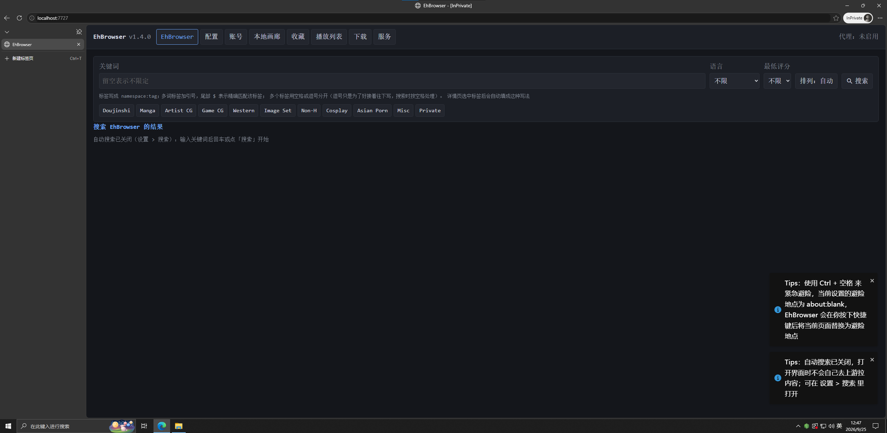

# EhBrowser

PC 端的 E-Hentai 浏览器。形态为本地服务 + 浏览器界面：进程只监听回环地址，界面在浏览器里打开，账号 Cookie 只留在服务端。

外站（e-hentai.org）与里站（exhentai.org）都支持。

源码可见，免费使用。许可为 [Apache License 2.0](LICENSE)：可自由使用、修改、再分发，含商用；再分发时保留许可与署名通知。详见[许可](#许可)。

> 
> [1.png](/docs/1.png)

## 目录

- [环境要求](#环境要求)
- [安装](#安装)
    - [方式一：npm 全局安装](#方式一npm-全局安装)
    - [方式二：从源码运行（clone 后自己跑）](#方式二从源码运行clone-后自己跑)
    - [方式三：Windows 安装器（从 Release 下载）](#方式三windows-安装器从-release-下载)
- [使用](#使用)
- [配置与数据目录](#配置与数据目录)
- [账号与 Cookie](#账号与-cookie)
- [下载与本地库](#下载与本地库)
    - [详情页快照：本地浏览不再拉详情](#详情页快照本地浏览不再拉详情)
    - [续传（下载被打断之后）](#续传下载被打断之后)
- [项目结构](#项目结构)
- [开发约定](#开发约定)
- [发布](#发布)
    - [打标签与发 Release](#打标签与发-release)
    - [便携包（`npm run release:portable`）](#便携包npm-run-releaseportable)
    - [Windows 安装器（`installer/windows`）](#windows-安装器installerwindows)
    - [发到 npm](#发到-npm)
- [当前状态](#当前状态)
- [许可](#许可)

## 环境要求

| 项      | 要求                                                                        |
| ------- | --------------------------------------------------------------------------- |
| Node.js | >= 22.18.0。依赖原生 TypeScript 类型擦除，`node` 直接运行 `.ts`             |
| 网络    | 中国大陆直连 e-hentai.org 不可达，须自备代理（HTTP / HTTPS，SOCKS5 不支持） |
| 账号    | E-Hentai 账号。访问里站要求账号具备 ex 权限                                 |

运行时依赖 `undici`（HTTP 传输与代理）。`typescript`、`oxfmt` 只用于开发。

Windows 上不想自己装 Node.js 的话，用[方式三](#方式三windows-安装器从-release-下载)的安装器，它会代装。

## 安装

### 方式一：npm 全局安装

```bash
npm install -g ehbrowser
ehbrowser
```

首次运行创建配置目录与默认配置文件，并调用系统默认程序打开界面地址。

`main` 与 `bin` 指向构建产物，安装与发布都走 `dist/`。仓库里的 `.ts` 入口只用于开发。

### 方式二：从源码运行（clone 后自己跑）

前置条件见[环境要求](#环境要求)：Node >= 22.18.0、git、可用的 HTTP 代理。

```bash
git clone https://github.com/EtherosGroup/EhBrowser.git
cd EhBrowser
npm install     # 要装出与作者一致的依赖树，改用 npm ci（按仓库里的 package-lock.json）
npm start       # 直接运行 src/main.ts，无需构建
```

启动后终端打印界面地址（默认 `http://localhost:7727/`），并尝试打开浏览器。参数：

```bash
npm start -- --port 6000     # 换端口
npm start -- --no-open       # 不打开浏览器
```

进入界面后需要先在设置页填代理、在账号页登录，步骤见[使用](#使用)。

常用操作：

- 只改前端时：`npm run dev:web` 启动 watch 构建，改动后刷新页面。服务端仍由 `npm start` 启动的进程提供。
- 前后端一起改时：`npm run dev` 同时做前端 watch 构建与服务端自动重启。
- 运行构建产物（与 `npm install -g` 的形态一致）：`npm run build` 之后执行 `npm run preview`。前者把服务端编译到 `dist/`，把前端构建到 `dist/web/`。
- 更新：执行 `git pull`。`package-lock.json` 有变化时再执行一次 `npm install`（或 `npm ci`）。
- 数据位置：`npm run config:path` 打印配置、数据、缓存三个目录及其来源。默认 `~/.config/ehbrowser`、`~/.local/share/ehbrowser`、`~/.cache/ehbrowser`。需要让数据全部落在一个目录（便携版）时，设置 `EHBROWSER_HOME`。
- 卸载：删除 clone 出来的目录。需要彻底清理时，再删除上面三个数据目录。

启动失败时对照下表：

| 现象                                      | 原因与处理                                                                                 |
| ----------------------------------------- | ------------------------------------------------------------------------------------------ |
| `npm start` 报语法/类型擦除相关错误       | Node 低于 22.18.0。`node -v` 确认后升级                                                    |
| 界面能打开，搜索一直转圈或报超时          | 未配代理。中国大陆直连上游不可达，见[使用](#使用)第 4 条                                   |
| 提示端口被占用                            | 改用 `--port` 指定其他端口，或结束占用 7727 的进程                                         |
| `npm ci` 报锁文件与 `package.json` 不一致 | 依赖改过，锁文件未更新。执行 `npm install` 重新生成，并把 `package-lock.json` 一起提交     |
| 改了源码，界面没变化                      | 界面产物需要重新构建：前端改动执行 `npm run dev:web`（或 `npm run build:web`），再刷新页面 |

### 方式三：Windows 安装器（从 Release 下载）

不想自己装 Node、也不想碰命令行的 Windows 用户用这个：到 [Releases](https://github.com/EtherosGroup/EhBrowser/releases) 下载最新一版的 `EhBrowser-<版本>-installer.exe`，双击运行。它依次做四件事：

1. 检查系统版本，低于 Windows 10（build 10240）直接退出，不做任何修改。
2. 检查 Node.js：大版本 ≥ 22 就直接用（22.18.0 以下会警告「可能不够新」但继续）；没装或大版本低于 22 则询问是否由它下载并静默安装官方 MSI（取 nodejs.org 上最新的 v22.x；提权时默认装到 `C:\Program Files\nodejs`，非管理员时默认 `%LOCALAPPDATA%\Programs\nodejs`，都可改目录）。这一步通常需要管理员权限，非管理员运行时它会先问要不要提权重启。
3. 执行 `npm install -g ehbrowser@latest`，装完打印 `ehbrowser` 的位置，以及新开终端后怎么启动。
4. 询问是否在桌面和开始菜单各建一个 `EhBrowser` 快捷方式（默认建）。快捷方式指向 [启动器](#windows-安装器installerwindows)：双击后浏览器直接打开界面，不会闪出命令行窗口，通知区域还会多一个托盘图标。

它是命令行程序，结束时停住等按空格再关窗口，方便看输出。参数：

```bat
EhBrowser-1.3.0-installer.exe -y                    :: 全部取默认值，不询问（无人值守用）
EhBrowser-1.3.0-installer.exe --check               :: 只检查系统版本与 Node.js，不做任何修改
EhBrowser-1.3.0-installer.exe --dry-run             :: 只打印将要执行的命令，不下载也不安装
EhBrowser-1.3.0-installer.exe --node-dir D:\nodejs  :: 指定 Node.js 的安装目录
EhBrowser-1.3.0-installer.exe --no-shortcuts        :: 不建快捷方式（--shortcuts 则跳过询问直接建）
```

退出码：`0` 成功、`1` 参数错误、`2` 系统版本不支持、`3` 用户取消、`4` Node.js 安装失败、`5` ehbrowser 安装失败。快捷方式没建成不会把退出码变成非 0（应用本身已经装好了），但会在输出里逐条报出原因。

**托盘图标**：右键菜单是「打开浏览器 / 查看日志 / 重启客户端 / 关闭客户端」，左键单击直接打开界面。再双击一次快捷方式不会起第二个客户端，只是请托盘把界面调出来。「关闭客户端」连托盘一起退出，也可以从界面里的「关闭服务」关（那样托盘会跟着收摊）。启动失败时（比如已经有一个在跑、端口被占）会弹消息框说明原因，客户端本来要打印到控制台的东西写在 `%LOCALAPPDATA%\ehbrowser\launcher.log`（跨次启动追加，超过 1 MiB 时清空）。

三点提醒：安装器没有代码签名，SmartScreen 可能先拦一下（「更多信息」→「仍要运行」）；它装的始终是 `ehbrowser@latest`，旧版安装器也会装到最新版，要固定版本就自己执行 `npm install -g ehbrowser@<版本>`；卸载用 `npm uninstall -g ehbrowser`，桌面与开始菜单那两个快捷方式要自己删。源码在 [`installer/windows/`](installer/windows)，可以自己看或自己编。

## 使用

1. 启动服务。终端打印本地地址（默认 `http://localhost:7727/`）与退出方式。需要换端口时用 `--port`：`npm start -- --port 6000`。
2. 在浏览器中打开该地址。
3. 首次打开会弹一条提醒，内容为本软件免费、被收钱即为被骗。提醒里附仓库与 QQ 群（597399171）两个问询处。点「知道了」后不再出现。
4. 首次使用要完成两项设置：
    - 代理：填入可用的 HTTP 代理地址（SOCKS5 不支持）。未配代理时所有上游请求都会超时。
    - 账号：在「账号」页用 E-Hentai 账号密码登录，或导入已有的 Cookie。登录后服务端取回 `igneous` 并探测里站可达性。
5. 之后正常浏览。配置改动即时生效，无需重启。

常用命令：

| 命令                   | 用途                                           |
| ---------------------- | ---------------------------------------------- |
| `npm start`            | 开发模式运行源码，无需构建                     |
| `npm run dev`          | 前端 watch 构建 + 服务，服务端改动自动重启     |
| `npm run build`        | 编译服务端到 `dist/`，并构建前端到 `dist/web/` |
| `npm run build:web`    | 只构建前端                                     |
| `npm run dev:web`      | 前端 watch 构建，改动后刷新页面                |
| `npm run preview`      | 运行构建产物                                   |
| `npm run config:path`  | 打印生效的数据目录与文件状态                   |
| `npm run typecheck`    | 类型检查                                       |
| `npm run format`       | Oxfmt 格式化（4 空格缩进）                     |
| `npm run format:check` | 格式检查                                       |

## 配置与数据目录

路径按各平台惯例，可用环境变量覆盖。

| 用途 | Linux                      | macOS                                     | Windows                          |
| ---- | -------------------------- | ----------------------------------------- | -------------------------------- |
| 配置 | `~/.config/ehbrowser`      | `~/Library/Application Support/ehbrowser` | `%APPDATA%\ehbrowser`            |
| 数据 | `~/.local/share/ehbrowser` | 同上                                      | `%LOCALAPPDATA%\ehbrowser`       |
| 缓存 | `~/.cache/ehbrowser`       | `~/Library/Caches/ehbrowser`              | `%LOCALAPPDATA%\ehbrowser\cache` |

目录内文件：

```
user_setting.json    用户偏好，权限 0644，可直接编辑
auth_setting.json    账号与 Cookie，权限 0600，含密钥
ehbrowser.db         SQLite：程序标记、画廊缓存、下载任务、阅读进度、用户播放列表
```

缓存目录里另有一份临时文件，随进程生命周期存在：

```
temp/search.json     上一次检索的条件与结果，权限 0600；应用启动时先删掉再重新预热
```

环境变量覆盖，优先级由高到低：

```
EHBROWSER_CONFIG_DIR / EHBROWSER_DATA_DIR / EHBROWSER_CACHE_DIR   分项覆盖
EHBROWSER_HOME                                                    便携模式，三者在 <HOME>/ 下
XDG_CONFIG_HOME 等                                                系统默认
```

`EHBROWSER_HOME=<目录>` 把全部数据收进单个目录，便于随身携带或隔离测试。

配置文件结构：

```jsonc
// user_setting.json
{
    "schemaVersion": 1,
    "locale": "zh-CN",
    "preferredSite": "e-hentai", // e-hentai | exhentai
    "network": {
        "requestIntervalMs": 5000, // 连发 maxSequentialRequests 次之后等这么久再发下一批
        "maxSequentialRequests": 5, // 一批最多连发几次；上游建议连发 4～5 次后等待约 5 秒
        "requestTimeoutMs": 30000,
        "proxy": { "enabled": false, "protocol": "http", "host": "127.0.0.1", "port": 7897 },
    },
    "viewer": { "mode": "mpv", "imageQuality": "org", "preloadCount": 2 },
    "download": {
        "directory": "",
        "keepArchive": true,
        "preferredResolution": "org",
        "concurrency": 2,
    },
    "translate": { "tags": false },
    "safety": { "hintEnabled": true, "url": "about:blank" }, // Ctrl+空格 的避险地点
    "ui": { "theme": "system", "thumbnailSize": 250, "pageSize": 25 },
}
```

配置文件损坏时改名为 `*.corrupt-<时间戳>` 并回退默认值，程序照常启动；迁移前生成 `*.bak-<时间戳>`。

## 账号与 Cookie

- Cookie 只存在于服务端进程与 `auth_setting.json`，不下发到浏览器。界面只读到登录状态摘要。
- 所有上游请求由服务端转发，浏览器不直连 E-Hentai。
- `igneous` 是里站通行证，有效期约一个月。登录时上游不下发，说明该出口节点不适用，换节点后重新登录。界面显示 igneous 已用天数，临近过期时提示。
- 登录在论坛域（forums.e-hentai.org）以表单完成。成功后服务端保存 `ipb_member_id` 与 `ipb_pass_hash`，再访问画廊站取回 `igneous`。取不到 igneous 时登录仍算成功，只是里站不可用。
- 退出登录只清除凭据，账号条目保留在列表里，便于再次登录。
- `fetchIgneous` 与 `probeExAccess` 都不属于主流程：`fetchIgneous` 先请求外站、再请求里站（不同出口节点下发的域不同），里站那一跳是兜底；`probeExAccess` 只回答「里站是否可达」。两者都捕获传输错误并且不向上抛出：
    - 里站连不上（代理不放行、节点不稳定）时只记一条 warn，登录照常成功，账号照常保存，里站显示为不可达。早先这里把异常直接抛给界面（`upstream_unavailable：…ECONNRESET`），登录中断，账号也无法保存。
    - 取到 igneous 才写进账号；取不到就提示「换节点后重新登录」，不影响外站。

## 下载与本地库

- 归档下载在服务端排队，同时只运行一个任务。上游限流严格，归档由对方打包，串行处理更稳定。
- 任务状态落在 SQLite 的 `downloads` 表，进度经 SSE 的 `download.changed` 推给界面。进程退出时未完成的任务标记为失败。
- 单个文件不做断点续传：先写 `<名称>.part`，完成后改名，中断或取消时删除未完成的文件。逐页下载整体可续，见下文「续传」。
- 归档需要登录，并消耗 GP。H@H 下载提交后由官方客户端在后台取回，本程序不再介入后续过程。
- 取消执行中的任务会中断正在进行的请求（含归档地址解析）。排队中的任务直接标记为取消。

落盘形状（本地库）：

```
<下载根>/<分辨率>@<画廊名>/
    .ehbrowser             元数据（JSON，权限 0600）：gid、token、标题、分辨率、页数、读到第几页、归档名、画廊信息快照（summary）、详情页快照（detail）
    .ehbrowser.downloading 逐页下载进行中的标记：记着这一版是谁在下；下完就删
    0001.jpg               解压出来的图片，按归档内的顺序重命名为页序文件名
    archive.zip            归档本身，`download.keepArchive` 为 false 时不保留
```

### 详情页快照：本地浏览不再拉详情

- 下载时连画廊详情一起落盘（`.ehbrowser` 的 `detail` 字段）：标签分组、评分人数、收藏数、体积文本、可见性、预览图、系列关系。逐页下载本身需要读取一次详情以取得页数，一并存下，不多发请求。归档下载额外取一次详情，多半命中详情缓存。
- `GET /api/galleries/:gid/:token` 本地优先：该画廊有本地副本、又存了快照时，直接回快照，不发上游请求。播放器与详情页都走这个接口，点开本地画廊立刻出标题、标签与页数，断网也能看。带 `?fresh=1` 时不读快照（更新检查要的一定是新的数据）。下载服务内部取详情仍直接请求上游，页数必须是最新的，否则升级下载会下错页数。
- 详情页封面同样本地优先：有副本时用 `/api/library/:gid/:resolution/pages/1` 这一页本地文件，省掉取图片页那一步。说明文字写成「封面（本地副本第 1 页）」。
- 旧版本下载的目录里没有快照：第一次打开照常问上游，并把快照补存进去，之后不再问。手动修改快照或删除 `detail` 字段都可以，下次打开会重新补存。
- 本地化范围只到详情数据：缩略图条仍取上游的精灵图（那是图片），断网时显示占位；点缩略图开的灯箱仍按 `galleries.page` 取图。

### 续传（下载被打断之后）

逐页下载可续：已下好的页全部留着，重来时只补缺的那些页，不删也不重下。

- 版本判定依据 `.ehbrowser.downloading`，里面记录 gid + 分辨率 + 页数。重来时按下列情况处理：
    - 标记为同一版本时继续下载，已有的页全部跳过（进度条从那几页起算，速度与字节数一并带上）。
    - 标记为其他版本或其他分辨率时（目录被复用）清空重下，否则页序会错乱。
    - 没有标记，但目录里是另一个 gid 的成品（升级下载撞上同名目录）时同样清空重下，日志写明「属于 #xxx」。
    - 没有标记，也没有任何下载记录（手工放进去的文件、更早版本留下的）时保留不删，只记一条 warn，按续传处理。

    判定规则：只在能确认换了一版时清空，其余情况保留已下好的内容。

- 每下一张之前还会再核一次磁盘（`library.pageBytes`）：上面那份「已下好」的清单是任务开始时扫出来的，中途目录还可能多出文件（上一次没跑完留下的、手工放进去的、另一个任务写的），只认清单就会白下一遍。已有的成品按它的实际大小计入进度后跳过，不向上游要这一页的地址。按页号认、不认扩展名，因此上游换了图床扩展名也不会在同一页留下两个文件。
- 图片页 token 只认「上一张的 `nextToken`」，并且记住它属于哪一页：上一页恰好是这一页的前一页时才传下去。中间跳过页之后就对不上了，这时把 token 留空，交给 `gallery.imagePage` 按页号从画廊页解析（结果按 20 页一批缓存），否则会把第 N 页的 token 用在第 N+1 页上。

- 已下完的整本再下一次（例如重复发起两次）不重下任何一页：实测 20 页那本第二次只花 6 秒，全部页文件的 mtime 未变。
- 阅读进度不被重下抹掉：完成时写元数据，`lastReadPage` / `lastReadAt` 从原有元数据带过来。
- 续传判断直接读磁盘，不走页索引缓存。下载途中目录一直在变，缓存那份可能是刚建目录时的空快照，用它判断会把已下好的页当成没有，于是重下一遍。
- 归档下载是一次性的：归档是整包，没有 Range 支持，重来只能从头下载。
- 取消异步生效，因此任务带一个执行令牌。取消后立即重试时，上一次执行的收尾不会用 cancelled 覆盖新排入的队列（否则表现为点了重试没有反应）。

- 下载根：配置 `download.directory` 优先；未配置时用 `~/ehbrowser/download`，便携模式（`EHBROWSER_HOME`）下收进 `<HOME>/download`。

### 直连解析（绕开 DNS 污染）

与 EhViewer 的「内置 host」同一个思路：**只换域名解析成哪个 IP**，TLS 的 SNI 与 Host 仍是原域名，
证书照常校验。设置 > 网络 > 直连解析（默认关闭）。解析顺序四级，照抄 `EhHosts.lookup`：

1. 用户自定义 hosts（设置里那段文本，`域名 = ip1, ip2`，`#` 注释）
2. 内置种子表（`src/eh/hosts.ts`）
3. DoH（`src/eh/doh.ts`）：端点**写死 IP**，因此这一步自己不依赖 DNS
4. 系统解析（`node:dns`）

实现要点：

- 接入点是 undici 8 的 **DNS interceptor**（`interceptors.dns({ lookup })` + `Dispatcher.compose`），
  在 `src/eh/http.ts` 的 `setDirectResolver` 里装；`src/services/upstream-service.ts` 按配置决定装代理、
  装直连解析、还是一个都不装（**有代理时不用它**：解析由代理那头做）。
- 坑：interceptor 的 `lookup` 返回空数组**不会**回退到系统解析，而是直接判 `No DNS entries found`，
  所以第四级兜底必须自己写进 `lookup` 里。
- 两种 DoH 协议都支持：RFC 8484 二进制（Yandex `77.88.8.1`，实测国内可直连，但只吃二进制）
  与 Cloudflare/Google/Quad9/AdGuard 那种 JSON 接口。端点连续失败两次进入 60 秒冷却，
  结果按 TTL 缓存，避免被端点当成扫描而重置连接（实测会被 ECONNRESET）。
- 内置表只是**种子**：Cloudflare 是 anycast，**任意** CF 边缘 IP 配上正确 SNI 都能服务这些站
  （实测 `104.16.132.229` + SNI `e-hentai.org` → 200），所以 CF 前置的域名不怕某个 IP 过期；
  其余主机（ehgt.org、upld.e-hentai.org、s.exhentai.org）由 DoH 刷新。
- **无法处理 SNI 阻断**：如果所在网络是「TCP 通、ClientHello 一露出域名就被 RST」，任何 IP 都没用，
  只能走代理——`73.1` 那种情况下本功能唯一的作用是把原因说清楚，而不是让程序假装能连。

### 图片也走服务端（`/api/proxy/image`）

EhViewer 只有一套 OkHttp，API、页面、缩略图、图片全走它，所以换一次解析就全线生效。
EhBrowser 的图片原本是**浏览器直取**的（浏览器走系统 DNS），只改服务端解析会出现「接口通了、图是白板」。
因此开着直连解析（或配了代理）时，服务端会把**响应里的上游图片地址**改写成
`/api/proxy/image?url=…&_token=…`，由服务端带着修正后的解析去取、原样流回浏览器：

- 改写发生在 `sendJson` 这一层（`server.ts` 的 `rewriteRef` + `eh/image-proxy.ts` 的
  `rewriteUpstreamImageUrls`），**只改发给浏览器的响应，不落库**——代理地址带令牌、也随模式变化，
  存进 `.ehbrowser` 或数据库会脏数据。前端一行都不用改。
- 什么时候启用：`直连解析开启` **或** `配了代理`。理由是服务端只要能取到图就让服务端取——
  浏览器那侧可能根本连不到图床；两者都关时恢复浏览器直取。
- 取图走传输层的字节流入口（`eh/http.ts` 的 `openUpstreamStream`），不经文本解码、也不整个读进内存：
  实测 0…255 全字节值原样透传。Host 与 SNI 仍是原域名（只换解析、不换 URL）。
- **白名单**：`eh/image-proxy.ts` 只放行 `e-hentai.org` / `exhentai.org` / `ehgt.org` / `hath.network`
  及其子域（按标签边界匹配），其余一律 400。这是本机代取任意 URL 的入口，放开了就是 SSRF 跳板，
  令牌也照旧必需（`` 带不了请求头，令牌走 `_token` 查询参数，与 `library.image` 同款）。
- 取不到时回 502 并写明原因（含「若为 SNI 阻断型网络请改用代理」这句），而不是给浏览器一个坏图。

- 下载入口的弹窗是共用组件 `web/src/components/DownloadDialog.vue`：画廊详情页的「下载」与播放器控制栏的下载按钮都打开它，打开时才读取归档选项，不多发上游请求。
    - 弹窗先于归档选项的读取出现。早先播放器的做法是先读到归档选项才弹窗，未登录时读归档返回 403，弹窗不会出现，逐页下载的按钮也无法进入。当前归档读不到时弹窗仍然弹出，把原因写在弹窗里，下面仍然列出逐页下载。
- 两种下载方式在弹窗里同时给出（归档选项读不到时只列出逐页那两条，原因写在弹窗里）：
    - 归档下载（`org` / `res` / H@H）：一次请求取得整包，速度较快，需要登录并消耗 GP。
    - 逐页下载（`pages-res` / `pages-org`）：不需要账号，图片页 showpage 不限游客。逐页取图片地址，再逐页落盘成 `<下载根>/pages-res@<画廊名>/0001.jpg`。代价是上游限流严格（默认 5 秒一次），页数多时很慢，弹窗里写明了这一点。`pages-org` 取原图，`pages-res` 取重采样图。
    - 逐页任务把 `pages_done / page_count` 也落库（DB v4），下载页那行显示「第 X / Y 页」，不显示字节百分比。速度按字节算，逐页下载同样显示速度。
    - 未登录时归档不让排队：`downloads.create` 收到 `org`/`res`/`hath` 而当前无账号时立刻回 `not_logged_in`（「归档下载需要登录并消耗 GP；未登录时请改用逐页下载」），不排注定失败的任务。更新管理器处理 `org`/`res` 的本地副本时也落到这条规则上，它会自动改用 `pages-<分辨率>` 下载，画质不变，只是速度较慢，并用一条提示说明已改成逐页下载。
    - 图片下载会重试：H@H 图床节点连不上、读取中途连接断掉都常见。单张图片失败重试 2 次（共 3 次尝试，间隔递增），归档重试 1 次（共 2 次）。HTTP 状态码不对与用户取消都不重试。失败信息带页号（「第 3/43 页下载失败」），整本重下时能看出失败位置。取消与超时的文案分开（「下载已取消」/「请求超时」/「请求失败」），不再出现「请求失败：This operation was aborted」。
    - 下载请求的超时与取消信号取并集（`AbortSignal.any`）。早先只传调用方的信号，整条请求没有总超时，卡住的连接会一直保持。
- 画廊名需要经过一次清洗：各平台非法字符取并集替换成空格，去掉结尾的点与空格，截断到 100 字，空名字退回 `untitled`。
- 归档下完就地解压：只挑图片条目（跳过目录、`__MACOSX/`、隐藏项），按归档顺序重命名为 `0001.jpg`，扩展名沿用原样。重新下载先清除目录里旧的页文件，避免上一版多出来的页残留。
- 解压自行实现（`services/zip.ts`，只用 `node:zlib`）：支持 stored 与 deflate、CRC32 校验、Zip64 的中央目录；不处理加密与分卷。归档损坏时明确报错，不写入任何损坏的图片。
- 界面读本地图片走 `GET /api/library/:gid/:resolution/pages/:page`：直接回图片本身（非 JSON 信封），令牌经 query 的 `_token` 传递，`web/src/api.ts` 的 `libraryImageUrl()` 直接给 `` 用。内容类型覆盖 gif/webp/bmp/avif，播放器放 gif 不受影响。
- 失败或取消的任务在下载页有「重试」：`POST /api/downloads/:taskId/retry` 把同一行改回排队、清空错误与进度（页数也需要清空，否则排队中的进度条会先显示上一轮的分数），不新增历史。
- 阅读进度写回 `PATCH /api/library/:gid/:resolution`，直接落到该目录的 `.ehbrowser`。本地库列表 `GET /api/library` 以目录为唯一事实来源，手动删除文件、手动修改目录都能如实反映。
- 早先的版本把归档直接下载成 `<数据目录>/downloads/<标题>.zip`。这类散落的 zip 不符合本地库的目录形状，在界面上不列为本地画廊。

## 项目结构

```
src/
├── main.ts        入口
├── server.ts      本地 HTTP 服务
├── api/           服务端与浏览器之间的接口契约（信封、路由表、DTO、SSE 事件）
├── eh/            上游客户端：传输层、gdata / gtoken / showpage、页面 HTML 解析、地址构造
├── config/        持久化：JSON 存储管线、schema、迁移、校验、SQLite
├── platform/      平台差异：系统识别、数据目录解析、错误描述、外部程序打开
└── services/      业务编排：配置服务、上游装配、画廊服务、账号服务、下载服务、检索结果缓存、本地库与 zip 读取、播放列表、更新检查、收藏、标签翻译词库、日志、客户端状态诊断

web/                 前端源码（Vue 单文件组件 + Vite），构建产物输出到 dist/web
├── router.ts      路由表，标签页即路由
├── status.ts      运行状态与 SSE 事件流，模块级单例
├── api.ts         按契约推导的请求客户端
├── animation.ts   手写的补间引擎（缓动、逐帧推进、可打断）
├── card-preview.ts 悬浮预览的几何计算，纯函数
├── icons.scss     图标字体：iconfont 的 @font-face 与 .icon-setting / .icon-search
├── assets/        静态资源（目前只有 iconfont.ttf；小于 4KB，构建时被内联进 CSS）
├── gallery-groups.ts 结果网格的分组结构与组标题规则
├── playlist.ts    画廊播放列表与用户播放列表，模块级单例（用户列表读服务端）
├── updater.ts     更新检查的界面侧状态，随 SSE 逐条并进列表
├── favorites.ts   收藏的界面侧状态：本地夹与云端分类
├── safety.ts      紧急避险：Ctrl+空格 的避险地址与提示
├── player-source.ts 播放器的页地址来源：本地一次铺满，网络按窗口限并发解析
├── player-cache.ts 播放器预热集合：模块级单例 + 本地存储，按预算做 LRU
├── downloads.ts   下载任务的界面侧状态，右上角队列里的下载入口与下载页共用
├── translation.ts 标签与类别的中文翻译：开关、词库的取用
├── translation-db.ts 内置翻译表与词库的合并查询、按输入反查标签（纯函数）
├── logs.ts        日志的界面侧状态：目录、文件名与最近若干条
├── welcome.ts     首次打开的提醒开关（只记在 localStorage，不落配置）
├── tag-search.ts  选中的标签 -> 搜索框里的关键词、用户输入 -> 送上游的写法（纯函数）
├── search-history.ts 搜索历史（localStorage，最多 20 条）
├── diagnostics.ts 客户端状态提示：服务端状态 + 本地往返耗时 -> 右上角那组图标
├── auto-search.ts 自动搜索的开关状态与进入页面时的提示
├── messenger.ts   弹出消息封装
├── progress.ts    顶部加载条封装
├── sprite-cache.ts 精灵图预载与结果广播
└── components/    面板与通用组件
    ├── SearchPanel.vue          搜索条件、缓存优先恢复与翻页
    ├── GalleryGrid.vue          分组结果网格（含 hover 预览），搜索/本地画廊/收藏共用
    ├── GalleryPage.vue          画廊详情页，封面加信息
    ├── PlayerPage.vue           播放器页：把画廊变成可播曲目，含下载确认
    ├── PlaylistPage.vue         播放列表页：用户播放列表与两级进度
    ├── GalleryLibraryPage.vue   本地画廊页：网格 + 左下竖排功能按钮
    ├── DownloadDialog.vue       下载确认弹窗，详情页与播放器共用
    ├── ImageLightbox.vue        缩略图灯箱：就地放大看某一页
    ├── UpdateManager.vue        更新管理器：悬浮层，异步逐条出结果
    ├── FavoritesPage.vue        收藏页：收藏夹选择 + 同款网格与批量操作
    ├── Player.vue               播放器：翻页、缩放、自动播放、网页全屏
    ├── GalleryPreviewsPage.vue  全部预览图，逐组加载
    ├── Dialog.vue               弹窗：遮罩、进出一致、点空白不关
    ├── StatusIcons.vue          右上角的状态图标（覆盖展示，层级只低于 messenger）
    ├── DebugPage.vue            /debug：把状态图标逐个摆出来看（不在顶部标签里）
    ├── WelcomeDialog.vue        首次打开的提醒：这是免费软件
    ├── ImagePlaceholder.vue     图片占位层，按等待时长分档
    ├── SkeletonImage.vue        普通图片，带占位层
    └── SpriteImage.vue          精灵图缩略图，按偏移取格

installer/windows/   Windows 安装器 + 隐藏启动器：两个 exe 的 CMake 工程（MSVC、静态 CRT，免运行库）

scripts/
└── portable.mjs   打便携包：组装目录 + 自己按 PKZIP 格式写 zip（不引第三方依赖）

.github/workflows/
├── release.yml        推 v* 标签 -> 构建便携包与安装器 -> 建 Release 并附上两个附件
└── publish-npm.yml    推 v* 标签 / 手动触发 -> 发 npm（Trusted Publishing）
```

依赖方向单向：`main -> api -> services -> config -> platform`。上游客户端 `eh/` 独立于以上各层，只由 `services/` 调用。

上游请求的健壮性（`src/eh/http.ts`）：

- 请求走串行队列 + 连发上限：连续 `network.maxSequentialRequests` 次（默认 5，界面上称为「单次最多连续请求」）直接发出，发满这一批再等 `network.requestIntervalMs`（默认 5000ms）开下一批。这对应上游建议的「连续 4～5 次后等待约 5 秒」。等待从上一批最后一次请求开始计时，队列空闲一段时间后不再等待。
    - 早先的写法是每次请求之间都等一个间隔。一次操作要发好几条请求（详情 = gdata + 画廊页），多开几个页面就排成长队：同时打开 4 本没下载过的画廊实测 36.5s，改成连发后 5.8s。本机接口不受影响，上游在途时 `/api/library` 仍是 1～2ms。
    - 同一个键在途的读只发一次上游（`detail-cache.ts` 的 `inflight` 表）：两个标签页同时打开同一本、详情页与播放器同时进同一本，共用那一次请求。实测同一本并发 3 次：16.5s -> 0.34s。
    - 只有缓存命中的读完全不发请求。`fresh` 的调用方跳过读缓存，仍与在途请求共用（那本身就是正在向上游请求的数据）。
- 建连失败会重试：代理节点不稳定时常见「TCP 连上了、TLS 握手被重置（ECONNRESET）」，这类失败意味着请求没送到上游，重发是安全的。同一个请求最多尝试 3 次（间隔 0.8s / 1.6s），只重试「域名解析失败、连接被拒、握手被重置、socket 被提前关闭」。收到响应之后才出的错（读超时、body 断流）不重试，调用方取消也不重试。
- 传输层错误补一句原因：`describeTransportError()` 在原文后附上可能的原因（如「连接在 TLS 握手阶段被重置，请求没到达上游：多半是代理/节点不稳定，或该站点没走代理」），原文保留，便于排查。

## 开发约定

- ESM，`"type": "module"`；相对导入必须带扩展名且写 `.ts`（如 `import { x } from "./os.ts"`），编译时由 `rewriteRelativeImportExtensions` 改写为 `.js`。
- 启用 `erasableSyntaxOnly`：不使用 `enum`、`namespace`、构造函数参数属性等无法被类型擦除的语法。
- 代码由 Oxfmt 统一格式化，缩进 4 空格。
- 源码 `src/` 不进入发布包，`files` 仅包含 `dist`。
- 前端在 `web/`，用 Vue 单文件组件编写，由 Vite 构建到 `dist/web`。Vue 及其子包在构建期被打进产物，运行时不装任何 npm 依赖。
- 前端只依赖 `src/api` 契约推导路径与类型（`web/src/api.ts`），不手写 URL。
- 弹出消息统一走 `web/src/messenger.ts`（vue3-toastify 的薄封装），不在组件里直接调用 `toast.*`；字段级校验问题仍就地显示在对应输入框旁。
- 顶部加载条统一走 `web/src/progress.ts`（nprogress 的封装，按计数归零收尾），由 `web/src/api.ts` 在请求期间驱动。
- 面板切换过渡由 `App.vue` 的 `<Transition name="page" mode="out-in">` 与 `style.scss` 中的 `.page-*` 规则提供。
- 标签页即路由（`web/src/router.ts`，HTML5 路径）。服务端对不存在的无扩展名路径回退到 `index.html`，因此刷新与深链可用；带扩展名的请求仍按资源处理。
- 画廊详情是独立路由 `/g/:gid/:token`，进页只请求该画廊的详情与第一页，地址可收藏、可分享。详情页只把第一页当封面展示，不翻页；旧的 `?page=N` 转到阅读器的同一页。
- 进页先铺加载中的骨架：封面占位（带持续推进的进度条）+ 标题与信息条 + 操作按钮的位置，写一句「正在读取画廊信息…」。版面与真正的内容对齐，加载完不跳动。首次进入要等上游（一次 gdata + 一次画廊页），进过的画廊命中详情缓存后立即打开。
- 详情页有内存缓存（`services/detail-cache.ts`）：信息、封面、缩略图三样都存在服务端内存，再次进入同一画廊不发上游请求（实测首读 4.8s，再读 0.0s）。条数上限来自设置 > 浏览 >「最多缓存画廊」（`ui.cachedGalleries`，默认 20，填 0 表示不缓存），按 LRU 淘汰最久没用的一本，条数调小时下一次访问即收敛。设置页显示体积估算（「约 150 KB」，按缓存里的平均单本体积算），旁边有「清空详情缓存」。
    - 封面存的是 showpage 返回的图片地址，地址里的 keystamp 会过期，因此封面单独带 10 分钟有效期。信息与缩略图是静态内容，只受条数上限约束。
    - 需要一定新的数据的调用方传 `fresh`（HTTP 是 `?fresh=1`）：更新检查、收藏「更新标记号」、进入阅读器前的存在性检查都跳过读取，仍然写回。
- 看全部图片走阅读器 `/g/:gid/:token/read`，一页一张大图：按钮、键盘（← →、PageUp/PageDown、Home/End、Esc）与点图片左右分区都能翻，`?page=N` 直接定位。顺序前进时带上游给的 `nextPageToken`，省掉一次详情解析；拿到当前页后预取下一页，读过的页留在内存里，回退不再请求。舞台高度固定，换页不推动工具条。
- 详情页只铺前 20 张缩略图（`GalleryPage.vue` 的 `PREVIEW_LIMIT`），点其中一张从那一页开始读。其余经「加载更多预览图」进入 `/g/:gid/:token/previews`，该页逐组拉取并追加，可随时停止或继续。
- 搜索卡片的悬浮预览由 JS 算动画，不用 CSS 过渡：指针停留 0.5 秒（`HOVER_DELAY_MS`）后，预览区从卡片当下的浮起状态展开并盖住这张卡片。几何在 `card-preview.ts`（纯函数，展开区不小于卡片的包围盒、收在视口内，宽度要容得下左侧缩略图与右侧文字列），逐帧推进在 `animation.ts`。
    - 进入与离开卡片按 `pointermove` 的落点判断，不用 `mouseenter` / `mouseleave`。预览区会盖住卡片，用后者会在展开瞬间收到一个非预期的离开事件，指针停在原地时预览会反复开关。
    - 指针落在展开的预览区上即保持展开；指针离开卡片与预览区就立即退场：缩回卡片上（`CLOSE_MS`，160ms），内容先淡掉，落位后卡片回位。退场不排延时。早先用过「离开后等 140ms 再收」，而落点判断每帧都在执行，指针持续移动时那次延时被反复顺延，预览无法收起。
    - 退场开始后不被后来的落点判断打断或重排（`closePreview` 在 `closing` 期间直接返回），指针一直在动也能完整退场；退场途中指针回到那张卡片或预览区上，则从当前进度接着展开（`resumePreview`）。滚动、跳转、换页、卸载走 `resetPreview`，直接收起且不播动画：这时卡片位置已变，动画与位置不一致。
    - 计时按用途分开：`dropPreview` 不修改停留计时，`resetPreview`（跳转、换页、滚动、卸载）连计时一起清。早先两者都清全部计时，于是「上一张的预览还没退完就移到下一张」时，新卡片刚排上的停留计时被一并清掉，指针停在该位置时再也等不到展开。
    - 指针一直停在某张卡片上而它既没展开也没在计时（例如上一张的预览刚收完）时，`setHover` 补一次计时。被 Esc 收掉的那张例外，需要移开再回来才重新计时。
    - 预览里的缩略图按上游竖图比例（2:3）占满内容高度，宽度由此算出并写进 `--thumb-w`，图片用 `object-fit: contain` 整张放进格子：不裁两侧，也不因拉满高度而放大画质导致模糊。内边距与间距由 `PREVIEW_PADDING` / `PREVIEW_GAP` 经 CSS 变量下发。
    - 卡片浮起的位移与缩放同样由 JS 逐帧写入 `transform`，`POPPED`（`card-preview.ts`）是唯一数值来源，CSS 只负责描边与投影的过渡。
- 结果网格统一走 `GalleryGrid.vue`，入参是分组数据 `groups = [{ title, items }]`（类型与组标题规则在 `gallery-groups.ts`）：搜索只有一组，标题按规格写成 `搜索 {关键词 ?? "EhBrowser"} 的结果`；排行榜按时期分组，本地画廊与收藏按自己的维度分组，复用同一组件。
    - 卡片去处由 `to` 函数给出（搜索页给详情页，本地画廊给阅读器），仍是 `RouterLink`，中键与「复制链接」照常可用。
    - 多选页面传 `mode="select"` 与 `v-model:selected`：卡片改用 `button` 渲染，点卡片即选中，不跳转，也不展开悬浮预览（预览会盖住卡片，影响点选）。
    - 悬浮预览整套逻辑（落点判断、浮起、展开与退场）都在这个组件里，换一批结果时由 `watch(groups)` 清理，复用方不必自行管理。
- 弹窗统一走 `Dialog.vue`：遮罩 + 进出场过渡，层级取 `--z-dialog`（压过播放器与悬浮预览）。按规格只有「取消」「右上角 X」以及键盘 Esc 能关，点遮罩空白处不关。Esc 在捕获阶段拦截并阻止传播，压在播放器上时不退出全屏。
- 「服务」页可以关掉整个服务：`POST /api/system/shutdown` 先把响应写完，再由 `main.ts` 走与信号量同一条优雅关闭路径（关服务 -> 刷配置 -> 关库 -> 退出），界面看到的是一次正常响应。
- 下载入口在右上角那组状态图标里，排在最右边（见「客户端状态提示」一节）。它只在有未结束的任务时出现，用绿色系区分「正在干活」与左边那几枚「出错」，数量写在图标块右上角，点它进下载页；导航栏里的「下载」标签一直在，因此不显示它也不会找不到下载页。任务列表由 `web/src/downloads.ts` 单例持有，`status.ts` 收到 `download.changed` 就重取，下载页与这个入口共用同一份。
- 改了设置项的代码之后需要重启服务：界面每次都取最新构建的产物，服务端是启动时加载好的进程。服务端运行旧代码时不认识界面新增的字段（例如 `ui.cachedGalleries`），而设置页会把整份 setting 回传，服务端判定为「未声明字段」，整个保存被拒。为此 `web/src/settings-patch.ts` 做了两道处理：进设置页时比对快照，缺字段就在页面顶部挂一条提示（写明「重启 EhBrowser 服务」）；保存时把这些字段剔除，其余设置照常保存。重启后字段正常（配置结构也会自动迁移）。
- 配置分「网络 / 浏览 / 播放器 / 翻译 / 避险 / 搜索 / 下载 / 日志」八组（网络组含请求间隔、代理与直连解析；浏览组含默认站点、缩略图尺寸、每页条目数、语言标签、最多缓存画廊；搜索组含自动搜索开关与它那条提示的开关）。播放器组含查看模式、图片质量、向后预加载张数、缓存上限（默认 512MB）、同时加载张数、自动播放与间隔、播完循环；翻译组含标签翻译开关与词库的下载/删除；日志组含写文件开关与日志目录。新增字段要同时改 `config/schema.ts`（类型/默认值/字段表）、版本号、`config/migrations.ts` 的迁移步骤，以及 `api/dto/settings.ts`。迁移只补新字段，旧值原样保留（v1->v2 补播放器与翻译，v2->v3 补避险，v3->v4 补日志，v4->v5 补详情缓存条数，v5->v6 补自动搜索，v6->v7 补直连解析）。设置页支持 `/config?module=download` 这类深链，下载页左下角的设置按钮靠它直接展开对应分组。
- 标签与类别的中文翻译分两层，都在 `web/src/translation.ts`：类别 11 项与命名空间全量，标签名以高频词为主（专有名词不翻），未收录的原样保留。开关读设置后写入 `tagTranslation`，保存配置即全局生效。词库本身与这个开关无关：只要装了就在启动时载入一次（`ensureTagDatabase`），因为搜索框的标签补全要用它，关掉开关只是不显示译名。搜索卡片、悬浮预览、详情页的类别与标签，以及搜索条件里的类别按钮与语言下拉，都经 `categoryLabel` / `tagParts` / `namespaceLabel` / `tagName` 取值。直接读原文的只有发往上游的检索关键词。
    - 第一层是内置表（`translation-db.ts`）：常用标签与全部类别、命名空间，装完即用，不联网，覆盖不到的画师／角色／原作名不翻。
    - 第二层是词库：设置 > 翻译里的「下载/更新词库」从 [EhTagTranslation/Database](https://github.com/EhTagTranslation/Database)（EhViewer 系使用同一份数据）的发布包取 `db.text.json.gz`，剥掉简介只留「原文 -> 中文名」，存到 `<缓存目录>/translate/tags.json`（约 1.3MB，44262 条标签／13 个命名空间）。查询顺序是词库 -> 内置表 -> 原文，未安装词库时行为不变。
    - 数据不能打进仓库：它的许可是 CC BY-NC-SA 3.0（署名 + 非商业 + 相同方式共享），与本项目许可无关，也不受本项目许可覆盖。数据按需下载到用户机器，界面上标注出处，可一键删除。
    - 下载走用户配置的代理（GitHub 在国内大多需要代理才能连通），版本号取自 `latest` 跳转后地址里的 tag（发布包自带的 `version` 是数据格式版本）。失败重试一次，两次都失败就保留原有词库并把原因显示在设置页，不把不完整的词库写进缓存（先写 `.tmp` 再改名）。
    - 前端只在翻译开关刚打开时把整份词库拉进内存（约 1.9MB JSON，走本机回环），关掉不占内存。命中命名空间时按命名空间查，只有标签名时走扁平索引兜底。
- 日志在 `services/log-service.ts`：各服务的 `logger` 都走它，一条消息同时发往三个地方：控制台（保持 `[来源] 级别: 消息` 写法）、日志文件、SSE 的 `log.appended`（界面「服务」页直接显示）。

### 客户端状态提示（右上角那组图标）

异常时右上角覆盖显示一组小图标（30px，`--z-status: 9998`，只低于 messenger 的 9999）。整组压在页头下方：
页头在窄窗口下会换行、高度是变的，所以 `App.vue` 用 `ResizeObserver` 量出页头高度，把 `offsetTop` 传给 `StatusIcons`，
而不是写死一个数值（实测 900 / 1100 / 1600 宽下间距都是 10px）。

**最右边那一枚是下载入口**（不在错误状态里，也不是服务端推的）：有未结束的下载任务才出现，绿色系
（`--download-*`，绿色读作「正在干活」，不与左边红色的错误图标混在一起），数量写在它的右上角，点它进下载页。
正常时不出现。**图标是状态**（异常期间一直在，好转后自己消失），**messenger 的提示是提醒**（出错那刻弹一次），
两者不互相替代：文件系统出错时既点亮图标，错误本身仍按原来的路径返回或提示。

服务端 `services/diagnostics-service.ts` 采样后经 SSE 的 `system.status` 推给界面，界面在 `web/src/diagnostics.ts` 里
与服务端状态合并后交给 `components/StatusIcons.vue` 渲染。点一下图标会把说明、当前值与采样值弹成一条提示。

| 图标                     | 状态项           | 判定（括号内为恢复阈值）                                                                      |
| ------------------------ | ---------------- | --------------------------------------------------------------------------------------------- |
| 客户端繁忙               | `congestion`     | SSE 连接数 ≥ 6（≥4 个页面就算多）或在途请求 ≥ 24（<15）                                       |
| 与上游站点的通信变慢     | `upstream-slow`  | 最近 5 次上游请求的平均真实耗时 ≥ 8 秒，连续两次采样成立（≤ 4 秒）                            |
| 磁盘繁忙                 | `disk-busy`      | 磁盘探测（写 4KB 落盘 + 读回 + 删，每 10 秒一次）≥ 400ms，连续两次成立（≤ 150ms）             |
| 文件系统异常             | `fs-anomaly`     | 60 秒内出现过文件系统错误（探测失败，或任何接口/下载任务/日志里的 errno）（窗口过后自动熄灭） |
| 可用运行内存不足         | `low-memory`     | 系统可用内存 < 6%，或堆已用 > 堆上限的 90%（> 12% 且 < 80%）                                  |
| EhBrowser 客户端内部错误 | `internal-error` | 未捕获异常/未处理的拒绝（本次运行内一直亮），或 60 秒内 ≥ 3 次 500 响应                       |
| 与 EhBrowser 的连接变慢  | `latency`        | 浏览器自己量的往返中位数 ≥ 800ms（≤ 300ms）。服务端不知道浏览器等了多久，这一项只能本地测     |

- 采样很轻：计数每 2 秒看一次，磁盘探测每 10 秒一次；判定都带迟滞（进入与退出两个阈值），阈值都在该服务文件头那组常量里，也可以由 `thresholds` 选项覆盖。
- 「与上游站点的通信变慢」只计真实请求耗时，不含排队等本地节流的时间——节流是自己限速，不算上游慢（`eh/http.ts` 的 `observeRequestDuration`）。
- 未捕获异常不退出进程：本地工具正在下载/阅读时直接崩掉更糟，堆栈写进终端与日志，图标上写的就是「请前往终端查看」。
- 图标资源取自 `working/` 里那组，落库时按状态改名放进 `web/src/assets/status/`（`congestion` / `disk-busy` / `upstream-slow` / `latency` / `fs-anomaly` / `internal-error` / `low-memory`）。
    - 目录默认 `~/ehbrowser/logs`（便携模式下是 `<数据目录>/logs`），设置 > 日志里可改，留空用默认。支持绝对路径与 `~` 开头，相对路径按当前工作目录补全。每次写入都重新解析目录，改完立即生效，不用重启。
    - 按天一个文件 `ehbrowser-YYYY-MM-DD.log`（本地日期），一行一条：`2026-09-21 00:44:05 [info] [download] 消息`。`log.enabled` 关掉后不写文件，控制台与界面照旧。旧文件不自动清理。
    - 写文件是排队异步做的，失败（目录不可写等）只报一次错，不影响调用方。退出前 `flush()` 等队列落盘，避免最后几行丢失。
    - 界面侧 `logs.ts` 保存目录、文件名与最近 500 条，`log.recent` 路由（`GET /api/logs`）用于服务页首次打开时先铺一份。
- 详情页多选标签后的搜索走 `messenger.promise`：一条提示从「正在搜索选中的 N 个标签…」变成「找到 N 条结果」（失败给真实原因，被取消显示「已取消」），随后回到搜索页，关键词填进搜索框，结果从检索缓存直接铺出。查询失败时也照样跳转：搜索页会自行重试并显示原因，不因一次失败停留在详情页（被取消除外，此时已离开详情页）。
    - 关键词写法在 `web/src/tag-search.ts`，按官方标签搜索语法：每个选中的标签写成 `namespace:"多词标签"$`，空格分隔表示「同时满足」。引号必需：`f:big breasts` 会被当成 `f:big` 与 `breasts` 两个词条；`$` 表示只匹配这个标签本身，不做前缀匹配（`f:big$` 与 `f:big` 结果不同）。上游一次最多识别 8 个词条，选多了在按钮上提示。
    - 实测（真实上游）：`female:"big breasts"$ female:stockings$` 返回的每一条都同时带这两个标签；`female:big breasts` 与 `female:"big breasts"$` 的上游计数分别是 520,000 与 767,011，两个查询。
- 阅读交给播放器：`/g/:gid/:token/play`（`PlayerPage` 负责数据，`Player` 只负责播放）。详情页的「阅读」与全部预览页的格子都指向它；旧的 `/g/:gid/:token/read` 保留为重定向，旧书签可用。
    - 点缩略图打开灯箱（`ImageLightbox.vue`），在屏幕正中看这一页的大图：← → 翻页，Esc／点空白／× 关闭。进阅读模式只由「阅读」按钮触发。
    - 点「阅读」时先做一次检查：本地库有这本就直接进播放器（整本铺本地文件，详情也用下载时落盘的快照，零上游请求）；没有就问一次上游 `galleries.page?fresh=1`，确认这一页还在（详情页可能是缓存里的旧信息，画廊被删了也照样显示）。上游也拿不到就提示「该画廊可能已失效」，不进入空的播放器页面。
    - 页地址来源在 `player-source.ts`：本地已下载就把整个画廊一次铺满（地址是本地路由，不发上游请求）；没下载则按窗口（当前页 + `viewer.preloadCount` 张）异步解析，并发受 `viewer.maxConcurrentLoads` 限制，并复用上游给的 `nextPageToken`。单页失败只让那一页显示占位，不影响其余页与翻页。
    - 翻页不等待地址解析：地址未解析出来时那一页显示占位图，翻过去立即换页；页切换只改一个下标。
    - 缓存：字节由浏览器缓存，`player-cache.ts` 记录哪些图片预热过，并按 `viewer.maxCacheMb`（默认 512MB）做 LRU。本地页按画廊平均页大小估算，网络页按 2MB 估，上限再小也至少留当前页。
        - 这份集合是模块级单例 + localStorage：退出画廊、换一本、来回路由、刷新页面都不丢，只有重启服务端才清空。早先是每个播放器实例一份，离开画廊即丢失。
        - 归属按服务端「这一次运行」分区：`system.health` 的 `startedAt` 即本次运行的标识（`status.ts` 的 `serverSession`），它一变（重启过）旧记录立刻作废并从存储里删掉；拿不到标识时只保留在内存，不写入存储。
        - 键是图片地址，不是页号：同一个页号在不同画廊里含义不同。
        - 超出预算时从最久没用过的那一头开始清，正在查看的窗口每次都 touch，不会被清除。改设置里的上限只做 `resize`，不重建集合。
    - 操作：← → 翻页，↑ ↓ 缩放，Shift+滚轮缩放，滚轮翻页（带节流），空格暂停/继续自动播放（仅开启自动播放时），Esc 退出网页全屏。网页全屏盖住整个页面，控制栏改为底部居中浮层（进出场有过渡），左上角显示 `1/32`，开启自动播放时右上角显示 `AUTO`。
    - 浮层控制栏的进出：进入全屏时先露一下再收起；之后指针在画面上移动就出现，停住 1.2 秒（`BAR_HIDE_MS`）自动收起；底部另有一条 90px 高的热区（`.hotzone`，只在全屏时存在，位于控制栏之下），指针移进去不必先晃动鼠标就能叫出控制栏。指针停在控制栏或热区上时不收起，离开后再计时。指针停在热区上时退出全屏（按钮或 Esc），热区随之消失、不会再收到 `pointerleave`，因此退出时统一复位（`watch(fullscreen)`）。
    - 控制栏从左到右：进度、可拖动进度条、上一张、暂停/继续自动播放、下一张、自动播放开关、自动播放设置（间隔与循环）、图片翻译开关与设置（功能未实现，控件如实禁用）、收藏、下载。自动播放的三项直接写回 `viewer.autoplay`，设置页与播放器共用同一份状态。收藏与详情页、本地画廊页同一套做法：先读收藏夹，未收藏时放进第一个本地收藏夹并同步云端槽位 0，已收藏时把标记号改成 -1 再从本地夹移除（未登录也能用，云端那一步服务端只记日志）。详情里的 `favorite` 不会因为这次点击重新请求上游，因此本次结果记在本页的 `favoriteOverride` 里，换画廊时清掉。
    - 下载走 `Dialog`，文案按规格：标题「下载此画廊」、正文「要下载此画廊吗？共 N 页。」、按钮为取消与各分辨率的「下载{分辨率}{体积}」（体积取自 `galleries.archives`）。
- 播放列表分两个，语义不同，不可混用：
    - 画廊播放列表（`galleryPlaylist`）是当前画廊的每一页，进画廊阅读时清空重建（情景 1）。本地副本一次铺满，网络副本边解析边补。
    - 用户播放列表是手动加入的画廊，只追加不清空（情景 2），持久化在 SQLite 的 `playlist_items` 表，当前播放项记在 `meta` 的 `playlist.current`，重启不丢。`playlist.*` 几条路由每次都回整份快照（列表 + 当前项），界面拿到直接替换本地状态。
    - 一项的身份是 `<gid>-<分辨率或 net>`：同一画廊下载了两种分辨率算两项，`net` 表示没有本地副本。重复加入只刷新快照字段（标题、封面、页数），保留既有进度与顺序。
    - 播放列表页（导航栏「播放列表」）每行一个画廊：封面、标题信息、最右边的 `当前页/总页数`。顶部两级进度（第几个画廊/总画廊数、已播页数/总页数）。动作为播放、从头播放、清空（清空走弹窗二次确认）。点某一项从它记录的页开始播，它前面的项显示为已播放。
    - 加入入口有两处：画廊详情页的「加入播放列表」（同时查询一次本地库，有副本就把分辨率与平均页大小一并记下）；本地画廊页多选后批量加入。
- 本地画廊页（导航栏「本地画廊」）复用 `GalleryGrid`：`mode="select"` 时点卡片是选中，`to` 指向播放器。左下角一列竖排功能按钮：C 批量操作、B 排列尺寸、A 更新管理；默认只有图标，悬停 0.5 秒才浮出文字（`transition-delay` 只写在 hover 那条规则上，离开时立刻收起）。批量操作展开后依次为：收藏 / 取消收藏（二次确认）/ 升级 / 加入播放列表 / 移出播放列表 / 继续下载 / 删除（二次确认）。收藏两项都可用：收藏把选中项放进第一个本地收藏夹并同步云端槽位 0；取消收藏把标记号改成 -1 并从本地夹移除。
    - 「继续下载」重新加入同一分辨率的下载任务（解压会先清除旧页文件，缺页会被补齐）。「升级」带上选中项的 key 打开更新管理器，按规格先清空结果再只查这些项。
    - 排列尺寸改的是网格的 `columns`，目前是本地画廊页自己的一份（打开页面即用）。若要加到搜索页，需要再抽成共享状态。
- 更新管理器是悬浮层（不是独立页面，也不走 `Dialog`）：只有右上角 X 与键盘 Esc 能关，点遮罩无效。打开时只读缓存、不自动检查，带选中项进来才清空并检查这些项。检查排队串行执行（上游限流严格），每查完一条经 SSE 的 `library.update` 推给界面，边查边显示。缓存只在内存里，重启即清空（规格要求）。
    - 并发语义靠轮次号：`library.check` 带 `reset` 时轮次 +1、清空队列与结果、中断在途请求，上一轮迟到的结果一律不写入。否则「清空后只查选中项」会被上一轮污染。
    - 每条结果带 `latest`（上游更新版本的 gid/token/发布时间/页数）与 `error`。更新一条就是把 `latest` 加入下载队列（分辨率沿用本地这一版），「更新全部 / 取消全部更新」按此批量操作。
    - 进度单独推（SSE 的 `library.progress`：`{checking, pending}`）。只靠 `library.update` 推不出「还剩几条」：查完最后一条时队列已空，但那一轮循环还没结束。缺了它，右下角会一直停在「正在检查可用画廊更新（还剩 N）」，检查按钮也一直不可用。
    - `pending` 数的是还没查完的条数（含正在查的那条）。正在查的那条已从队列取走，直接报 `queue.length` 会从 N-1 起跳，表现为少了一条。
    - 行内第一个按钮是「删除更新任务」：只把这一条从更新列表里去掉（`POST /api/library/updates/forget`），不影响本地文件。正在检查的那条被删除后结果不会再次出现；显式再点一次「检查更新\*」仍会查回来。删除本地画廊走本地画廊页的批量操作。
    - 同一个组件也用在收藏页（`mode="favorite"`）：检查目标由收藏条目转成（`fav:<gid>`，没有分辨率），动作换成「更新标记号」。结果按 `source` 分开存、分开显示，本地画廊与收藏共用一份缓存互不干扰（`library.updates` / `library.check` 两条路由名不变，收藏复用它们，`library.check` 的 body 可传 `targets`）。
    - 「当前」那一栏的日期在收藏场景下取的是上游详情的发布时间（收藏条目本地只存加入收藏的时间，直接用会显示成加入时间）。
- 紧急避险：`Ctrl + 空格` 把当前页面整个替换成 `safety.url`（网页地址或本地 `file://` 地址，留空或未设置则落到 `about:blank`）。用 `location.replace` 替换当前地址，后退键因此回不去。快捷键挂在应用外壳上，全局生效，命中时 `preventDefault`。
    - 已知限制：Windows 的输入法切换与 macOS 的输入源切换都占用 Ctrl+空格，被系统接过去时浏览器收不到这次按键。这种情况只能改避险地点。
    - 进 EhBrowser 页面（`/`）时右下角提示一条 Tips，文案带当前避险地点。`safety.hintEnabled` 关掉后不再提示，同一次运行内只提示一次（`web/src/safety.ts` 里的一次性标记）。
- 下载页按规格排版：每行「封面 + 名称 + 进度条 + 百分比 + 速度 + 取消」，封面取自本地库快照（同一 gid 的已下载副本），总量未知时百分比位置显示已下载字节。左下角固定的「下载设置」按钮跳到设置页的下载分组。任务列表与右上角那个下载入口共用 `downloads.ts` 的单例，`download.changed` 到达由 `status.ts` 统一重取。
- 收藏分两层，不可混用：
    - 本地收藏夹与条目落在 SQLite（`favorite_folders` / `favorite_items`），离线可用。第一次打开收藏页自动建一个「本地收藏1」，保证总有夹可选。
    - 云端收藏夹是上游的十个槽位（0～9）：名称与数量、夹内画廊都从 `favorites.php` 取。未登录或上游不可达时只给本地那份，并把原因放进 `cloudError` 由界面显示。收藏/取消收藏走 `gallerypopups.php` 的表单提交（`favcat>=0` 放入对应分类，`-1` 取消）。
    - 条目上的 `slot` 是云端槽位：批量操作里的「设置标记号」把它改到另一个槽位（`-1` 即取消云端收藏）。本地先写，登录时再同步上游；同步失败只记日志，本地标记号照样生效。
    - 「更新标记号」是另一件事：同一画廊在上游分版本（2024-1-1 收藏的是 v1，2026-1-1 又出了 v2），更新标记号把这条收藏从当前这一版迁移到最新那一版（`favorites.items.refresh`）。服务端逐条取 `galleries.detail` 的 `current`：有更新版本就先取消旧版本的云端收藏，把新版本放进同一个槽位（未登录只改本地，此时如实回「只改了本地」），再把本地那一行连同 `added_at` 一起改成新版本（新版本若已在同一夹里，两行合成一行）。
    - 批量那一步复用更新管理器的界面（`mode="favorite"`，标题「更新标记号」、按钮「更新标记号 / 全部更新标记号」）：选中项作为检查目标传进去，逐条查、逐条显示，查完后就地迁移。
    - `favorites.php` 的解析用宽松匹配（分类链接 + 计数、`/g/{gid}/{token}/` 对）。上游结构变化时只会解析不到，界面表现为空列表，不会中断流程。这两段解析尚未对着真实上游验证过（本机无可用代理），只验证了未登录/不可达时的降级路径。
    - 收藏页顶部一行是收藏夹选择：本地夹与云端分类各一段，内容多时可滚动，下面用分隔线隔开「新建本地收藏夹」与「删除当前收藏夹」。网格与批量操作与本地画廊页同款，左键卡片跳 `/g/:gid/:token`。
- `<RouterView>` 的子组件按 `route.path` 作 key：切页面会重建，查询串变化（翻页、搜索条件写回地址）不会。
- 详情页标签可多选，选中后右下角出现搜索入口（按钮上直接显示将要搜索的那一行关键词），点击回到搜索页，关键词填进搜索框并搜索。
- 页面级请求都带 AbortSignal：离开路由会中断在途请求，避免返回后仍在加载、进度条不结束。
- 搜索条件写入地址栏（`query`、`language`、`minRating`、`categories`、`page`），从详情页返回会照着恢复并重取结果。
- 搜索页的输入框下面依次是两块可选区域（都只在有条目时出现），顺序即「关键词 / 标签 / 搜索历史」：
    - 标签建议：按输入框里**正在写的那一段**（最后一个空格或逗号之后）在词库里找标签（`web/src/translation-db.ts` 的 `searchTags`，反查索引在装词库时建好，4 万条标签一次查找约 1～4ms）。显示成 `译名（命名空间: 原文）`，每行一个；点一条就把上游的检索写法填进输入框（`namespace:"多词标签"$`，写法与 `tag-search.ts` 一致）。
    - 匹配同时比中文名与原文，优先级按输入的文字决定：写中文时是在找译名（先比中文名），写拉丁字母时是在写原文（先比原文），因此「男」先给「男性 / 男同 / 男娘」，「fem」先给「女性 / 男娘 / 女性化」而不是中文名里恰好含 fem 的条目。同档按译名与原文的长短排，短的在前。
    - 输入里带冒号时按命名空间缩小范围：`male:fem` 只在该空间里找，`male:` 直接列出该空间的标签。
    - 写入时只替换正在写的那一段（`[^\s,]*$`），前面的标签与分隔符（如 `language:chinese 男`、`男娘,fem`）都留着，写完把光标放回末尾，方便接着加标签。
    - 空格与逗号都算分隔，因此打完一个标签敲一个英文逗号就等于「开始写下一个标签」：建议区立刻换到逗号后面那一段，不用先删掉前面的内容。
    - 送上游前把逗号统一换成空格（`tag-search.ts` 的 `normalizeQuery`）：上游按空格切词、官方搜索规则也写明逗号不作分隔符（实测逗号当下会被容忍，但不依赖这一点）。因此输入框里是 `f:milf,m:muscle`，实际检索的是 `f:milf m:muscle`。词库里没有标签名带逗号，这样换不会伤到标签本身。
    - 搜索历史：`web/src/search-history.ts`，存在 localStorage（最多 20 条，重复的提到最前），只在发起检索时记录关键词，语种与分类这些筛选项不记。点一条整条填回输入框，右侧有「清空」。
    - 两块列表都是 `max-height: 280px` + `overflow-y: auto`（约 9 行）：条目多时自己滚，不把结果网格推走；整层还有一道 `max-height: min(80vh, 660px)` 兜底。
    - 词库未安装时标签建议用内置的常用表（约 200 条），功能不依赖词库是否存在。
    - 输入框有焦点时结果网格的悬浮预览暂停（`GalleryGrid` 的 `previewPaused` 属性）：这时用户是在用鼠标点输入框下方的标签建议，指针从结果区上经过不该弹出卡片预览，卡片也不浮起。焦点离开输入框即恢复；预览已经展开时点回输入框会立刻收起（指针没动，落点判断不会再跑，因此由 `previewPaused` 的 watch 收尾）。
    - 浮层的显隐看焦点：焦点落在筛选框里时才出现（点输入框，或点浮层里的按钮——用 `focusin` / `focusout` 判断，不用 `blur`，否则点浮层里的按钮会先把它自己收掉）。搜索历史尤其如此：默认不显示，点输入框才出来。检索发出后浮层先收起来让新结果完整露出来，再敲字或再点输入框时回来。
- 检索结果留一份会话缓存，界面重进搜索页时先铺内容：
    - 服务端把「最后一次检索的条件 + 结果」写进缓存目录的 `temp/search.json`（原子写，权限 0600），读以内层内存为准，内存中没有时才读磁盘。应用启动时先删掉这个文件，再由预热检索重新写一份，因此缓存不跨重启。
    - 启动后立刻按默认条件（`{ page: 1, limit: SEARCH_PAGE_LIMIT }`）预热一次检索，不阻塞启动，失败只记一条 `[gallery] warn`。这次预热的 Promise 会登记下来：界面在还没有缓存时 `GET /api/galleries/cache` 会等它结束，避免同一份结果拉两次；最多等 12 秒（`WARMUP_WAIT_MS`），预热卡住时返回 null，界面再发起一次检索。其代价是上游不可达（例如尚未配置代理）时，界面需要先等待预热失败才会报错。
    - 界面打开搜索页时按下列规则判定：地址带条件时按条件处理（缓存与之同组才直接铺内容，否则发起检索）；地址没带条件时先看缓存，缓存里有什么就铺什么（条件一并恢复到输入框，并写回地址），没有缓存时才拉取一次默认列表。判定用 `SEARCH_PAGE_LIMIT` 与逐字段比对，缺失与 `undefined` 视为相同。
    - 缓存只负责先出内容，不承担新鲜度：任何一次检索成功都会覆盖它。
- 图片一律带占位层：一层底色加底部一条进度条，不做扫光之类的循环动画。图片由浏览器直接向上游取（跨域、没有 CORS），真正的字节进度读不到，因此进度条按已等待时长推进：30 秒走到 90%（1 秒 8%、3 秒 25%、10 秒 65%），进度条不会走满，真正加载完成后才补完并随占位层淡出。等到 3s 补一句「仍在加载…」。失败时换成图标加说明，`retryable` 打开的调用方还会给重试入口。
    - 公共部分在 `web/src/components/ImagePlaceholder.vue`，普通图片（`SkeletonImage.vue`，失败时自动换地址重试一次）与精灵图缩略图（`SpriteImage.vue`）共用。
    - 画廊缩略图走上游的精灵图：一页 20 张拼成一张横向长图，由 `SpriteImage.vue` 取其中一格，预载结果（含原图尺寸）按地址缓存在 `sprite-cache.ts`，同一页只探一次，失败换地址重试一次。上游给的是「200px 宽的盒子 + 该格的 `background-position`」，页面里一格只有几十像素宽，偏移与整张图必须一起缩小，否则每格只剩原图一角。因此分两层渲染：外层是照上游声明尺寸的裁切窗口，内层按格数铺开整张图（宽度 = 窗口宽 × 格数，高度由原图比例定，不会拉伸），再按「偏移 ÷ 原图宽度」平移若干格。两层都用百分比表达，缩放随格子宽度自适应，样式里不写上游的绝对像素。同一个组件在详情页缩略图条与全部预览页（110px 起）都适用。
    - 加载完成的显示由占位层淡出完成，图片在下层始终可见，不做两次淡入。
    - 进度条只动 `transform: scaleX()`，不触发布局；减弱动效下换成一段静止的进度，不做补间。
    - 宽度不到 104px 的小格子（如详情页的缩略图条）放不下进度条与文字，靠容器查询（`@container`）自动收回，只留底色。
    - 占位层的颜色取 `style.scss` 里的 `--placeholder-*`；浮层层级取 `--z-card` / `--z-floating` / `--z-overlay` 一档，不写魔法数字。
- 字号统一走 `style.scss` 里的 `--font-size-*` 阶梯：基准正文 1.2rem，其余每档相差 0.1rem，全部用 rem（小数点后最多一位），组件里不写像素字号。
- 图标默认是组件里手写的 SVG（`fill: none` + `stroke: currentColor` + 1.7 线宽）。例外是三处用图标字体：下载页左下角的设置入口、播放器控制栏的自动播放设置按钮都用 `.icon-setting`，搜索按钮用 `.icon-search`，来自 iconfont 包（源码 `web/src/assets/iconfont.ttf`，声明在 `web/src/icons.scss`，在 `main.ts` 里随 `style.scss` 一起引入）。字体只有两个字形（setting `\e78e`、search `\e8ef`），2.2KB，小于 Vite 的内联阈值，构建时直接内联进 CSS，不额外请求，也不依赖服务端的字体 MIME 映射。用法：`<i class="iconfont icon-setting" aria-hidden="true" />`。旁边有文字说明时加 `aria-hidden`，颜色与字号跟随所在按钮（`font-size: 1em`），要单独调大就在调用处按 rem 写 `font-size`（播放器里写的是 `--font-size-lg`，与同一排 SVG 的 17px 相当）。
- 开发前端用 `npm run dev`（同时运行 watch 构建与本地服务），改动后刷新页面。只运行其中一部分时用 `npm run dev:web` 与 `npm start`。
- 不另起 `vite dev`：它会产生第二个源，Origin 与注入的令牌都不一致。
- 构建失败时 Vite 会清空 `dist/web`（`emptyOutDir`），页面暂时 404，改回来自动恢复。
- 样式可用 SCSS：全局样式是 `web/src/style.scss`，组件内写 `<style scoped lang="scss">`。

### 自动搜索与它的提示

「自动搜索」指**打开界面时自己去上游拉一份内容**，默认关闭：启动时预热一次检索、打开搜索页直接铺一份默认结果，
这两件事在关掉后都不做——这类工具不该不打招呼就去上游拉东西。设置 > 搜索里可以打开。

- 关掉后打开搜索页：缓存里有东西照铺（那不算新检索），没有就显示一句「自动搜索已关闭…」等用户自己点搜索或回车。
  地址里带条件时仍然检索（从详情页选好标签点搜索过来的），那不是自作主张。
- 服务端那半在 `main.ts`：`ctx.user.get().search.auto` 为假就不调 `gallery.warmSearch()`，只在日志里说明一句。
  关掉后会话中途再打开开关，不会补一次启动预热（界面自己会去拉，结果一样）。
- 界面那半在 `web/src/auto-search.ts` + `SearchPanel.restore()`。注意 `restore()` 会先等 `searchSettingsReady`
  （最多 2 秒）：配置是异步读回来的，直接读 `autoSearch` 的默认值会把「开着」误判成「关着」，那一次进页面就不检索了。
- 进入页面时提一句自动搜索的当前状态（说清能不能开、去哪开），提示的开关同在设置 > 搜索。
  这条提示与紧急避险那条都用 `autoClose: false`：不自动消失，点一下才收起。

### 调试页（`/debug`）

不在顶部标签里，从地址栏直接打开。页面把七个状态项逐行列出（图标、状态项名、代表什么、怎么判定），
底部显示服务端报回来的 `active` 与采样值。两条路子：

- **真的触发**：多开 SSE 连接（客户端繁忙）、往本地往返采样里喂一个慢值（与 EhBrowser 的连接变慢）。
- **强制点亮**：其余几项在真机上不好复现，走 `POST /api/debug/status` 绕过阈值先把图标摆出来，
  按钮再点一下恢复真实判定。该接口与其它接口一样要本地令牌。

`/debug` 只是把状态摆出来；真实效果在右上角那组图标（见上一节），页面上有个按钮直接跳回搜索页看。

## 发布

面向维护者：打标签 -> 发 Release（附便携包与 Windows 安装器）-> 发 npm。

### 打标签与发 Release

```bash
npm version minor                 # 改版本号并打本地附注标签（v1.0.0 -> v1.1.0）
git push origin HEAD --tags      # 推当前分支与标签；标签会触发 .github/workflows/release.yml
```

一个标签会触发**两条工作流，互不依赖**：

- `release.yml`：两个构建 job 并行，最后由一个 release job 汇总发版。便携包那条在 ubuntu-24.04 上跑：`npm ci` -> `npm run typecheck` -> 核对标签与 `package.json` 的版本是否一致（不一致就早失败，避免附件名与包版本不一致）-> `npm run release:portable` -> 把 zip 传成 workflow artifact。安装器那条在 windows-2025（当前即 VS 2026 镜像）上跑：同样的版本核对 -> `cmake --preset x64-Release` -> `cmake --build --preset x64-Release` -> 跑一次 `--help` 冒烟测试 -> 把 exe 改名为 `EhBrowser-<版本>-installer.exe` 后传成 workflow artifact。release job 等两个构建都成功，从 artifact 取回两个产物，用 `gh` 建 Release（标题取标签名，说明用 GitHub 自动汇总）并作为附件上传。只用仓库自带的 `GITHUB_TOKEN`，不需要密钥。同一标签重复推送时附件改为覆盖上传，可重入。
- `publish-npm.yml`：同样的构建与核对，然后把这一版发到 npm（`npm publish --provenance --access public`），用 Trusted Publishing 的 OIDC 临时凭证。它先查该版本是否已经在 npm 上，已发过就跳过，因此重复推标签不会多出一条失败记录。

两个构建各传 artifact、再由第三个 job 汇总，是因为安装器只能在 Windows 上用 MSVC 编，而便携包适合在 Linux 上打（`portable.mjs` 按 unix 的 mode 位记录 `启动.sh` 的可执行位）：分开跑能并行，且同一时刻只有一个 job 会碰 Release——两个 job 同时 `gh release create` 同一个标签会撞车（先到的建成功，后到的 422）。两个构建都成功才发版，因此不会留下只有一半附件的 Release。

两条分开跑而不是让 `release.yml` 调用 `publish-npm.yml`，是因为 **npm 的 Trusted Publisher 认的是触发这次运行的入口工作流**，不是真正执行发布的那一个。实测：用 `uses: ./.github/workflows/publish-npm.yml` 调用时，OIDC 拿得到、provenance 也签名上传了，但 registry 回 `404 Not Found - PUT https://registry.npmjs.org/ehbrowser`；直接跑 `publish-npm.yml`（手动或推标签）就成功（1.0.1、1.0.2 都是这么发的）。要让被调用的形式也成立，得去 npm 侧把工作流文件名改成 `release.yml`，不如让这个工作流自己盯标签。

手动触发走演练路径（在 Actions 页面点 Run workflow，或执行 `gh workflow run release.yml`）：同样构建打包，但只把 zip 与 exe 传成 workflow artifact（默认保留 90 天），不建 Release、不打标签、也不发 npm。正式发版前验证产物时使用这条路径。

### 便携包（`npm run release:portable`）

`scripts/portable.mjs` 先构建，再把解压后即可使用的一份复制进 `release/EhBrowser-<版本>/` 并打成一个 zip：

```
EhBrowser-1.0.0/
    dist/                服务端 + 前端构建产物
    node_modules/undici  生产依赖（当前只有它，自身没有依赖）
    package.json  LICENSE  README.md
    启动.sh / 启动.bat    设置 EHBROWSER_HOME 到包目录，然后 node dist/main.js
    使用说明.txt          给不懂 Node 的人看的几行说明
```

- 包内不带 Node 运行时：目标机器上要有 node ≥ 22.18.0（`使用说明.txt` 中也有说明）。
- 绿色版：启动脚本把 `EHBROWSER_HOME` 指到包目录，配置、数据库、缓存与默认下载目录都存放在包内（实测 `/api/config/paths` 三个根目录的来源都是 `portable-home`）。删除该行后恢复到按用户目录存放。
- 产物不进仓库：落在 `release/`（已加进 `.gitignore`），由 CI 作为 Release 附件上传。实测 280 个文件、约 800 KB。
- zip 由脚本按 PKZIP 格式自行写入（项目不引第三方依赖，Node 没有内置的 zip 写入，只有 zlib）：自行拼接本地文件头与中央目录，文件名打 UTF-8 标记（启动脚本名是中文），`启动.sh` 用外部属性保留可执行位。

### Windows 安装器（`installer/windows`）

`installer/windows/` 是一个独立的 CMake 工程（`main.cpp` 是安装器、`launcher.cpp` 是隐藏启动器，加一个 `CMakeLists.txt`、一个 `CMakePresets.json`），不依赖仓库里的 Node 工具链：

- `x64-Release` 预设用 `Visual Studio 18 2026` 生成器：`/O2` + LTCG + 静态 CRT（`/MT`）+ CFG，两个 exe 都不需要目标机器装 VC++ 运行库。本地构建（需要 VS 2026 与 CMake ≥ 4.2）：

    ```powershell
    cd installer\windows
    cmake --preset x64-Release
    cmake --build --preset x64-Release
    ```

    产物在 `installer/windows/out/build/x64-Release/`：安装器是 `bin/Release/ehbrowser-installer.exe`，启动器是 `bin/launcher/ehbrowser-launcher.exe`（`out/` 已进 `.gitignore`）。

- 安装器做四件事：检查 Windows 版本（低于 10 build 10240 直接退出）、检查并按需安装 Node.js（大版本 ≥ 22 即可用，缺则下载 nodejs.org 上最新的 v22.x MSI 静默安装，需要时会提权）、执行 `npm install -g ehbrowser@latest`、按需创建快捷方式。参数与退出码见[方式三](#方式三windows-安装器从-release-下载)。
- 装的始终是 `ehbrowser@latest`：安装器自己不绑定版本，因此旧版安装器也会装到最新版。
- **启动器**（`launcher.cpp`）是个子系统为 WINDOWS 的小程序，自己没有控制台：它用 `CreateProcessW` + `CREATE_NO_WINDOW` 起 `cmd.exe` 跑 `ehbrowser`，所以双击快捷方式不会闪命令行窗口。快捷方式指向它、参数是 `ehbrowser`，图标取 node.exe。要隐藏窗口只能这么做：`.lnk` 的「运行方式」只有常规/最大化/最小化，没有隐藏。
- 藏起来之后客户端就没人管得了，所以启动器常驻通知区域：右键菜单「打开浏览器 / 查看日志 / 重启客户端 / 关闭客户端」，左键单击直接打开界面。它按窗口类名做单实例——托盘在跑时再双击快捷方式只是请托盘打开浏览器，不会起第二个客户端。
- 子进程放进一个 job 对象（`KILL_ON_JOB_CLOSE`；先挂起创建、挂上后再放行，免得 cmd 抢先把 node 生出来），所以「重启 / 关闭」连 cmd 带 node 一起收掉，托盘自己被结束掉时也不会留下孤儿 node。代价是客户端不走自己的退出收尾：配置是原子写、SQLite 有日志（实测不丢），只是它最后那几行日志可能少一笔。
- 「打开浏览器」「查看日志」不用另配端口与目录：客户端启动横幅里有「地址：」和「日志：」两行，启动器从 `launcher.log` 里解析出来，自定义端口、自定义日志目录都能跟上。「查看日志」打开该目录下最新的 `ehbrowser-<日期>.log`，还没有就退回 `launcher.log`。
- 启动器优先用与自己同目录的那份 `ehbrowser.cmd`，那份没起来再退回按 PATH 找。不能靠退出码判断「命令没找到」——cmd 对「找不到命令」和「命令自己失败」都给退出码 1；按目录定先后，才能在刚装完 Node、Explorer 的环境块还没刷新时也起得来。
- 「起来没有」以横幅里的「地址：」为准（那是客户端 listen 成功之后才打印的）：只看进程还活着，会把「端口被占、卡在那儿」误判成起来了，托盘就会挂着一个不能用的客户端。一直没等到就把它收掉并报错。
- 启动失败只在有交互桌面时弹消息框（服务/SSH 这类会话里没人点，弹了就是一直等），两种情况下都往 `launcher.log` 记一笔。
- 启动器整个嵌在安装器的资源里（`installer.rc.in` 由 `configure_file` 生成，`EHBROWSER_LAUNCHER` 这个名字的资源），装完后释放到 npm 全局目录，所以 **Release 附件仍然只有一个 exe**。它把子进程的输出写进 `%LOCALAPPDATA%\ehbrowser\launcher.log`（跨次启动追加，超过 1 MiB 时清空），几秒内失败退出时用 MessageBox 把日志尾巴弹出来——隐藏模式最怕静默失败。
- 快捷方式由 `IShellLinkW` 直接生成，桌面用 `FOLDERID_Desktop`、开始菜单用 `FOLDERID_Programs`，因此 OneDrive 那类桌面重定向也能跟对目录。
- CI 由 `release.yml` 的 `installer` job 在 `windows-2025` 上构建，产物命名为 `EhBrowser-<版本>-installer.exe` 作为 Release 附件。没有代码签名。
- 卸载：`npm uninstall -g ehbrowser` 不会动快捷方式与启动器，要自己删桌面/开始菜单的 `EhBrowser.lnk` 和 npm 全局目录里的 `ehbrowser-launcher.exe`。

### 发到 npm

`.github/workflows/publish-npm.yml` 有两种入口：推 `v*` 标签时自动跑（直接发布），或者手动触发——在 Actions 页面点 Run workflow / `gh workflow run publish-npm.yml`，输入框中 `dry-run` 保持 `true` 时为纯演练（`npm pack --dry-run` + `npm publish --dry-run`）；想手动补发某一版就选分支/标签（`ref`）并把 `dry-run` 关掉。

发布用 npm 的 Trusted Publishing：npmjs.com -> 你的包 -> Settings -> Trusted Publisher -> GitHub Actions，填仓库 `EtherosGroup/EhBrowser` 与工作流文件名 `publish-npm.yml`（当前用的就是这条，1.0.1 是这么发出去的，带 provenance 签名）。不需要长期 token；npm、Node 的版本要求（npm ≥ 11.5.1）由 `node-version: 24` 满足。也可以在本地手动发布：

```bash
npm pack --dry-run          # 先看清单：应当只有 dist/ 与 README、LICENSE、package.json
npm publish --access public # prepublishOnly 会自动跑 npm run build
```

## 当前状态

| 层                      | 状态                                                                                                                                                                                                                          |
| ----------------------- | ----------------------------------------------------------------------------------------------------------------------------------------------------------------------------------------------------------------------------- |
| `platform/`             | 已实现：平台识别、数据目录解析、错误描述、外部程序打开                                                                                                                                                                        |
| `config/`               | 已实现：JSON 存储管线、schema、迁移、校验、SQLite 数据层                                                                                                                                                                      |
| `api/`                  | 已实现：契约层（59 条路由、信封、DTO、SSE 事件定义）                                                                                                                                                                          |
| `eh/`                   | 已实现：传输层（代理、Cookie、节流「连发上限 + 等待」、重定向、建连失败重试）与 gdata / gtoken / showpage                                                                                                                     |
| `services/`             | 已实现：config-service、upstream-service、gallery-service、detail-cache、auth-service、download-service、search-cache、local-library、zip、playlist-service、update-service、favorite-service、translate-service、log-service |
| `server.ts` / `main.ts` | 已实现：回环服务、令牌与 Origin/Host 校验、SSE、静态界面与令牌注入                                                                                                                                                            |

`npm start` 启动服务并打开界面（默认 `http://localhost:7727/`，首次打开弹一条「这是免费软件」的提醒）。可用：搜索（含结果缓存与启动预热）；详情（含精灵图缩略图条与就地放大的灯箱，下载过的画廊用落盘的详情快照，本地浏览不请求上游）；日志（控制台 + 文件 + 服务页实时显示）；播放器（翻页、缩放、自动播放、网页全屏，本地副本零请求）；播放列表（用户列表持久化，重启不丢失）；全部预览；标签翻译（含按需下载的完整词库）；播放器与翻译设置；配置修改；账号登录与切换；归档下载与逐页下载（游客也能逐页下载，落盘为本地画廊目录，详情页快照一并存下）；本地库列表与本地取图；下载失败重试；更新检查；收藏（本地夹 / 云端槽位 / 更新标记号）；关闭服务。

未实现或未验证：评分、排行榜、图片翻译未实现；云端收藏夹的页面解析只做了降级处理，未对真实上游验证；归档下载的完整链路（需登录且消耗 GP）未验证。详见下文「未做与已知限制」。

已接入路由示例（`TOKEN` 取自启动页面注入的 `window.__EHBROWSER__.token`）：

```bash
curl -H "x-ehbrowser-token: $TOKEN" 'http://localhost:7727/api/galleries?query=touhou&limit=5'
curl -H "x-ehbrowser-token: $TOKEN" 'http://localhost:7727/api/galleries/618395/0439fa3666'
curl -H "x-ehbrowser-token: $TOKEN" 'http://localhost:7727/api/galleries/cache'
curl -H "x-ehbrowser-token: $TOKEN" 'http://localhost:7727/api/playlist'
curl -X POST -H "x-ehbrowser-token: $TOKEN" -H 'content-type: application/json' -d '{"gid":618395,"token":"0439fa3666","title":"示例","thumbUrl":"","pageCount":32,"resolution":"org"}' 'http://localhost:7727/api/playlist'
curl -H "x-ehbrowser-token: $TOKEN" 'http://localhost:7727/api/library'
curl -X PATCH -H "x-ehbrowser-token: $TOKEN" -H 'content-type: application/json' -d '{"page":3}' 'http://localhost:7727/api/library/618395/org'
curl -o page1.jpg 'http://localhost:7727/api/library/618395/org/pages/1?_token='"$TOKEN"
curl -X POST -H "x-ehbrowser-token: $TOKEN" 'http://localhost:7727/api/system/shutdown'
```

搜索、详情与图片页均需先配置代理（`network.proxy`），否则上游不可达。

已知限制：

- 多标签页的浏览器连接上限：本机服务不限制并发（实测 24 路并发本机接口仍是毫秒级，20 张本地图 70ms 取完，4 条 SSE 长连接不影响别的请求）。HTTP/1.1 下浏览器对同一个源只开 6 条连接，每个标签页还会挂一条 SSE 长连接。标签页多、又同时各自加载本地图片时，会先在浏览器一侧排队。根本的解决办法是把 SSE 收成一条共享连接（SharedWorker + BroadcastChannel 扇出），目前未实现。
- 排行榜：规格只在「groups 数据模型」中以它举例（`[{title: "昨天"}, {title: "过去3天"}, …]`），没有要求实现。网格已支持多组，缺少的是上游排行榜接口。
- 图片翻译：规格明示「功能暂时不做」，界面只留如实禁用的开关与设置按钮。
- 标签翻译词库：按需下载 EhTagTranslation/Database 的发布包（见上文「标签与类别」）。未安装词库时只使用内置常用表，画师／角色／原作名不翻。GitHub 无法连接时设置页显示失败原因，原有词库不受影响。
- 评分：规格未要求，`galleries.rate` 仍是未实现的契约占位。
- 云端收藏夹的分类名/数量与夹内画廊解析是按经验编写的宽松匹配，未对真实上游验证（开发机没有可用代理）。失败时降级为空列表并在界面上给出原因，不影响本地收藏夹。

## 许可

本项目采用 Apache License 2.0，完整原文见 [LICENSE](LICENSE)：

- 在 `package.json` 中以 SPDX 标识声明：`"license": "Apache-2.0"`。
- 本项目可以查看、使用、修改、再分发，也可以商用（嵌入自己的产品、做成付费产品或付费服务）。按 Apache-2.0 第 4 条，再分发时随附一份 LICENSE、保留版权与署名通知，改过的文件注明「已修改」。
- 本项目不提供担保：Apache-2.0 第 7、8 条，软件按「原样」提供，作者不为使用后果负责。
- 本软件免费。首次打开界面会弹一条提醒说明（见上文「使用」）。遇到有人收钱出售本软件的情况，可直接从[仓库](https://github.com/EtherosGroup/EhBrowser)下载，或到 QQ 群 597399171 询问。
